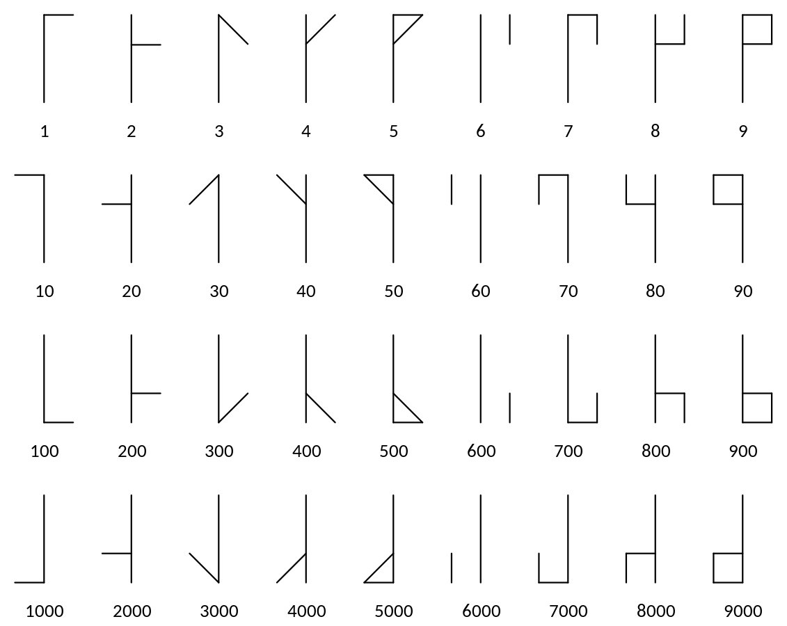

# Cistercian Numeral Maker
Program to create a representation of any number on the interval [0, 9999] following the Cistercian numeral system.

A description of this numeral system can be found on [this link to wikipedia](https://en.wikipedia.org/wiki/Cistercian_numerals).

This system consist in represent a number by composition of its digits bearing in mind the position they occupy as units, tens, hundreds and thousands. The symbols for each digit on each position can be seen on the following image:

Some examples:

# License
This script is licensed under the [MIT License](https://github.com/JAFS6/CistercianNumeralMaker/blob/main/LICENSE).

# Author
[Juan Antonio Fajardo Serrano](https://www.linkedin.com/in/jafs6)
